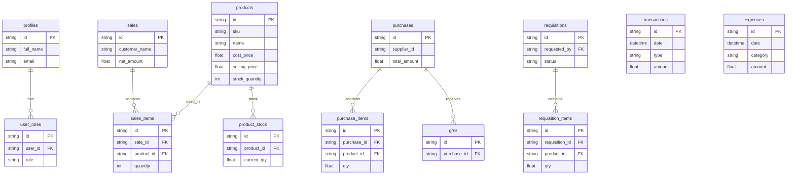

```mermaid
erDiagram
  profiles ||--o{ user_roles : has
  products ||--o{ sales_items : used_in
  sales ||--o{ sales_items : contains
  purchases ||--o{ purchase_items : contains
  purchases ||--o{ grns : receives
  products ||--o{ product_stock : stock
  requisitions ||--o{ requisition_items : contains

  profiles {
    string id PK
    string full_name
    string email
  }
  user_roles {
    string id PK
    string user_id FK
    string role
  }
  products {
    string id PK
    string sku
    string name
    float cost_price
    float selling_price
    int stock_quantity
  }
  sales {
    string id PK
    string customer_name
    float net_amount
  }
  sales_items {
    string id PK
    string sale_id FK
    string product_id FK
    int quantity
  }
  purchases {
    string id PK
    string supplier_id
    float total_amount
  }
  purchase_items {
    string id PK
    string purchase_id FK
    string product_id FK
    float qty
  }
  grns {
    string id PK
    string purchase_id FK
  }
  product_stock {
    string id PK
    string product_id FK
    float current_qty
  }
  requisitions {
    string id PK
    string requested_by FK
    string status
  }
  requisition_items {
    string id PK
    string requisition_id FK
    string product_id FK
    float qty
  }
  transactions {
    string id PK
    datetime date
    string type
    float amount
  }
  expenses {
    string id PK
    datetime date
    string category
    float amount
  }
```

